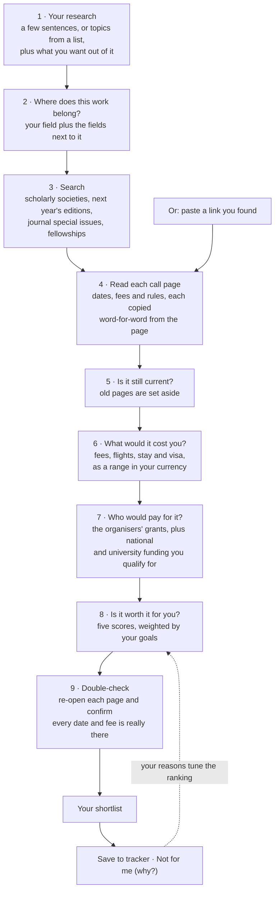

# Grapevine: Product Requirements Document

*Finds the conferences, journal calls and fellowships a researcher would otherwise never hear about, and tells them honestly whether each one is worth their time and money.*

**Live prototype:** [mavencourse2026.vercel.app](https://mavencourse2026.vercel.app) · **How it was built:** [SKILLS.md](SKILLS.md)

---

## 1. Why this exists

Humanities researchers mostly hear about opportunities by word of mouth: a supervisor forwards an email, a senior mentions a deadline, someone posts a screenshot in a group chat. That grapevine only reaches people already connected to it. There's no single place to look, and nothing that tells you whether something you *did* find is worth going to.

**Grapevine is that place, plus the judgement.**

---

## 2. The problem in five questions

**What's the problem?**
Finding opportunities depends on who you know, so it's unequal. Judging them is slow, so people skip it: fit, eligibility, deadlines, cost and funding all live on different pages. People end up applying to the wrong things, missing the right ones, or discovering too late that they can't afford to go.

**Who is it for?**
PhD students and early-career researchers in the humanities and social sciences. They're short on time, careful with money, often need visas, and are poorly served by existing tools, which lean towards STEM and the Global North.

**Why does it matter?**
Conferences and fellowships build careers through contacts, publications, funding and visibility. The cost of finding and judging them falls hardest on first-generation academics, people at less-resourced universities, and Global South researchers, who also face foreign-currency costs and visa hurdles.

**Why use AI?**
Because this is judgement over messy writing, not a database lookup. Every call page is written differently. A conference called "Regeneration(s)" can be the perfect conference for research on caste and social media without sharing a single keyword with it. Eligibility rules are buried in paragraphs. Grants depend on other deadlines ("apply once your paper is accepted"). A language model can read all of that. A keyword filter can't.

**Why more than a search box?**
The value is in the chain: work out where someone's research belongs, find conferences, journals and fellowships there, read each page, check the dates, cost it, find money for it, judge whether it's worth it, then double-check the facts. No single question to a chatbot does all of that reliably.

---

## 3. What the user sees

1. **Tell us your research.** Describe it in a few sentences, or pick topics from a list, or both. Then pick up to three things you want out of it: meet people, get published, a well-known conference, keep it affordable, feedback on your work. Then add passport, currency, budget and visa appetite. ORCID import is optional.
2. **Your shortlist.** Grapevine **searches the web live for your topics** (about a minute, showing each search as it runs) and returns 6–8 real calls, each with a **quick score**. Three numbers sit at the top. Calls are ranked like an index: rank, score with five small bars, a clear link to the call page, and the same four facts in the same order every time (next deadline · cost · funding · visa). Opening one runs the **full check** (about a minute), which reads the call page and works out cost and funding. Calls that look out of date, or whose edition has already happened, are not shown. **"See an example"** instead opens one of 8 example researchers, in different countries and career stages, whose shortlists were built ahead of time.
3. **"Is it worth it?"** for each opportunity. A score out of 100 and a one-line verdict. Four key facts at a glance: next deadline, cost, funding, visa. Tabs underneath for the detail: *Worth it?* · *Deadlines* · *Cost & funding* · *Can I go?* · *About*.
4. **Tracker.** Saved deadlines in date order, exportable to a calendar.
5. **Paste a link.** Found something yourself? Paste it and Grapevine reads it and scores it like everything else.

### The "worth it" score

Five questions, each scored 0–100 with a one-line reason:

| | Question it answers |
|---|---|
| **Fit** | How close is it to my research? (by meaning, not just matching words) |
| **Standing** | Is it established and well respected, or a predatory one? |
| **Network** | Who would I meet? |
| **Outcomes** | What would I come away with: a publication, feedback, a strong CV line? |
| **Feasibility** | Can I realistically go, given cost after funding, visa and timing? |

The user's goals decide how much each question counts. Choosing "keep it affordable" makes feasibility count for more. Saying "not for me — too expensive" nudges it further. A famous conference can therefore rank *below* a smaller one when it's the wrong move for this person this year, and the page says why.

**Out of scope for now:** writing applications, crawling the whole web, and anything that acts on the user's behalf.

---

## 4. What Grapevine will and won't do

| Grapevine does this on its own | Grapevine never does this |
|---|---|
| Searches, reads call pages, estimates cost, finds funding, scores and ranks | Registers, pays, submits or books anything |
| Adds deadlines to your tracker and calendar | Gives immigration advice. Visa notes are general information with a link to the official source |
| Adjusts your ranking when you say why something isn't for you (always visible and reversible) | Presents a guess as a fact. Anything not found on the source page is labelled "inferred — check" |

Principle: **it does the reading and the thinking; you make every decision that costs money or commits you to something.**

---

## 5. How it works

Steps 2 and 3 are how Grapevine finds conferences you wouldn't search for. For a researcher working on caste and social media, it reasons that "internet studies" is a neighbouring field, finds that field's main society, and then finds that society's 2026 conference. It never uses a hardcoded list. Step 9 is a separate check that doesn't trust step 4.

---

## 6. What it's made of

Each numbered step above is written down once, in plain language, as a **skill**: a short instruction file covering what to do, what to watch out for, and what never to do. The same files are used in two ways:

- **While building:** they're run by hand, weekly, to gather and check real opportunities. Today's shortlist was produced this way.
- **In the live site:** the site sends the same instructions to Claude when you describe your research or paste a link.

| Skill | Step |
|---|---|
| draft-profile | 1–2 |
| scout-opportunities | 3 |
| extract-opportunity | 4–5 |
| estimate-cost | 6 |
| find-funding | 7 |
| compose-brief | 8 |
| verify-grounding | 5 and 9 |

Two **reference lists** hold stable facts, so they don't have to be searched for every time: a list of **funders by country** (India's includes ICSSR's conference travel scheme), and, coming next, a list of **scholarly societies by field**.

Under the hood it's a small website on Vercel that calls Claude through Anthropic's API: Claude Sonnet 5 for searching and judging, Claude Haiku 4.5 for suggesting topics and reading call pages. Detailed data formats live in [`corpus/schema/`](corpus/schema/).

---

## 7. Keeping it honest and safe

- **Every date and fee shows its source.** Tap "source" to see the exact words from the page. Anything not found there is labelled *inferred — check*.
- **Old pages are left out.** A call posted in 2021 isn't shown as open, even if every word on it is quoted correctly, and a conference that has already happened is replaced by its next edition.
- **Status follows the dates.** Whether something is open, attend-only or "next edition" is worked out from its dates in code, not taken on the AI's word.
- **Costs are ranges with their assumptions stated**, never a falsely precise number.
- **Predatory conferences and journals are flagged.** This audience is actively targeted by fake conferences and journals.
- **One pick from outside your usual field** is always included, so the feed doesn't only show what you'd already search for.
- **Pasted links are fetched safely.** Internal and private addresses are blocked, and page text is treated as something to read, never as instructions to follow.
- **Spending is capped**: per-request limits, a per-visitor hourly limit, and a monthly spend limit on the API account.
- **Privacy:** your passport is used only for visa and fee-tier checks. Anything Grapevine infers about you is shown as an editable guess.

---

## 8. How we'll know it works

| What we measure | How | Target | So far |
|---|---|---|---|
| Are dates and fees read correctly? | Hand-check against the source page | ≥90% | 3 of 3 spot-checked calls correct |
| Is every ✓ fact really on the page? | Automatic re-check (step 9) | 100%, or flagged | 44 of 47 passed; the 3 failures were caught and flagged |
| Does it find things you wouldn't have? | Compare with a plain keyword search | ≥2 in the top 10 | 6+ in the top 10 (AoIR, ECSAS, SAMCS, MSA, Heidelberg, AAS) |
| Is the top of the shortlist relevant? | The researcher rates the top 5 | 4 of 5 | Next phase |
| Are visa notes right? | Known test cases | Always correct and sourced | Next phase |
| Does feedback improve the ranking? | Top 5 before and after | Measurable improvement | Next phase |

A running **failure log** sits alongside these numbers (see [SKILLS.md](SKILLS.md#results)). It's the most useful record of what to fix next.

---

## 9. Build plan (three remaining classes)

| Phase | What | Status |
|---|---|---|
| **1 — Real data and the core experience** | The 7 skills. Ready-made shortlists for 8 example researchers in 8 countries. Live search for your own profile, with quick scores and a full check on open. Live topic suggestions and paste-a-link. Onboarding, shortlist, "worth it" and FAQ pages. | ✅ Done |
| **2 — Accounts and memory** | Simple username and password so your profile and saved items follow you. A saved database of opportunities and funders instead of files. A society list for better discovery. More countries' funders. | Next |
| **3 — Keeps itself fresh, and learns** | A weekly automatic refresh (search, read, check). Feedback that measurably improves the ranking. The remaining evaluations. Final polish and walkthrough. | After |

---

## 10. Open questions

- **Accounts without email:** there's no password reset. Show a one-time recovery code at sign-up?
- **Cost per user:** a live search costs about 35¢ and each full check about 12¢ (Claude Sonnet 5 for searching and judging, Claude Haiku 4.5 for reading pages). With accounts, cache results so the same call is never checked twice for the same person.
- **Other countries:** the funder list starts with India. Which countries next?

---

*Grapevine: because the best way to hear about something shouldn't be knowing the right person.*
