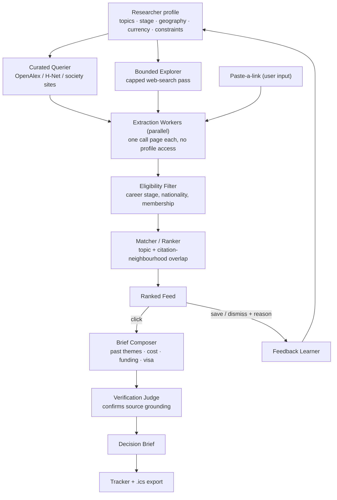

# Grapevine — Product Requirements Document

*An AI agent that finds academic opportunities a humanities researcher would otherwise never hear about, and tells them whether it's worth going.*

**Status:** v1 specification, organised around the questions a reviewer of an AI product should ask first.

---

## 1. Origin

Humanities researchers — media studies, gender studies, sociology, literature — mostly find out about conferences, journal calls and fellowships by word of mouth: a supervisor forwards an email, a senior mentions a deadline, someone posts a screenshot in a WhatsApp group. That grapevine only reaches people already attached to it. There is no centralised place to look, and nothing that tells you whether an opportunity you did find is actually worth your time and money.

**Grapevine** is that missing place, and the missing judgement.

---

## 2. The problem, in five questions

**What problem are we solving?**
Discovery of academic opportunities is social, and therefore unequal — scattered across venue sites, mailing lists and private group chats, with no index spanning them. Evaluation is manual, and therefore skipped — even a found opportunity requires stitching together relevance, eligibility, deadline sequencing, cost and funding from separate sources, so people over-apply, under-apply, or miss deadlines.

**Who is the user?**
PhD candidates and early-career researchers in the humanities and social sciences: internationally mobile, time-poor, cost- and visa-sensitive, and underserved by tooling that skews STEM (WikiCFP) and Global North.

**Why is it worth solving?**
Conferences and fellowships compound careers — networking, publication, funding, visibility. The overhead of finding and judging them falls hardest on people with the least institutional support: first-generation academics, less-resourced universities, and Global South researchers who additionally face foreign-currency costs and visa friction their peers don't. The information is already public; what's missing is aggregation and judgement.

**Why is AI useful here?**
This is judgement over messy, unstructured information, not a lookup problem. Call pages have no shared schema. Relevance in the humanities is semantic — a conference titled "Intimacy and Infrastructure" may be the best possible venue for dating-app research and share zero keywords with it. Eligibility is stated in prose, conditionally. Deadlines are interdependent (a scholarship deadline that presupposes acceptance). Cost and visa facts must be synthesised honestly, with uncertainty marked. That's reasoning and language work — an LLM agent does it; a rules engine can't.

**Why an agent, not a smarter search box?**
Because the value is in the pipeline, not a single call: query multiple sources, extract inconsistent pages into one schema, filter for eligibility, rank for semantic fit, assemble a cost/funding/visa picture, and verify every high-stakes claim is grounded — then repeat weekly and adjust to feedback. No single prompt does that; it needs sequenced, specialised steps with guardrails between them.

---

## 3. What Grapevine is

Three surfaces, in the order a user meets them:

1. **Preferences** — a research profile (topics, career stage, geography, currency, constraints), bootstrapped from an ORCID/OpenAlex ID or filled in manually. Always user-confirmable.
2. **The feed** — the landing page: a ranked list of upcoming opportunities scored against the profile, with a reserved slice for deliberate exploration so it doesn't collapse into a filter bubble. A "paste a link" box covers anything the feed missed.
3. **The brief** — click an opportunity to get what it's about, past themes/papers, eligibility, sequenced deadlines, cost estimate in your currency, funding options, and a visa advisory — each field marked verified or inferred.

**Out of scope for v1** (deliberate cuts): application/cover-letter drafting, broad open-web crawling (curated sources + one bounded explorer pass only), a second built-out vertical, real-time trend detection, and anything that acts on the user's behalf (see §4).

---

## 4. The agent: receive / decide / do / produce

| | |
|---|---|
| **Receives** | Researcher profile · an opportunity (discovered or pasted) · feedback signals |
| **Decides** | Which sources to query and what to explore · whether an opportunity is *relevant* (semantic) and the user *eligible* · how deadlines sequence · which facts are grounded vs. inferred · how to reweight the profile from feedback |
| **Does** | Queries sources, runs one bounded web-search pass · extracts pages into schema · assembles cost/funding/visa picture · writes deadlines to tracker + `.ics` · updates profile from feedback |
| **Produces** | Ranked, eligibility-filtered feed with fit rationale · a full decision brief per opportunity · a tracker with sequenced deadlines |

**Autonomy boundaries**

| Action | Autonomy |
|---|---|
| Query, extract, rank, filter eligibility | Fully autonomous |
| Fit rationale, cost estimate, scholarship/visa notes | Autonomous, every field labelled verified / inferred / advisory |
| Add to tracker, generate `.ics` | Autonomous |
| Adjust profile weights from feedback | Autonomous, profile always visible and editable |
| Register, pay, submit, book travel | **Never** — hard-coded stop |
| Anything visa-related | **Advisory only** — official source linked, verify-before-acting flag |

Principle: autonomous over gathering and reasoning, never autonomous over committing the user to anything. Money, applications and immigration are where a confident-but-wrong agent does real damage.

---

## 5. Agent workflow



Two loops worth noting: the **outer** discovery loop runs weekly (cron) and feeds the corpus that the feed ranks against; the **inner** loop runs per-click, is cached per (opportunity, profile), and never re-triggers discovery.

---

## 6. System architecture

**Agents**

| Agent | Responsibility |
|---|---|
| Profile Bootstrapper | Drafts topics, citation neighbourhood, career stage from ORCID/OpenAlex or CV; always a draft, user confirms |
| Curated Querier | Queries known sources by topic tag — cheap, high precision |
| Bounded Explorer | One capped web-search loop for venues the curated pass missed — where real discovery happens |
| Extraction Workers (×N, parallel) | Each parses one call page into the Opportunity schema; context-starved by design — no profile, no other pages, no credentials |
| Eligibility Filter | Flags/drops opportunities the user can't apply to |
| Matcher / Ranker | Scores fit via topic + citation-neighbourhood overlap, returns rationale |
| Brief Composer | Assembles past themes, cost estimate, funding, visa note |
| Verification Judge | Re-checks every high-stakes field against the source text; downgrades ungrounded claims to "inferred — verify" |
| Feedback Learner | Updates profile weights from dismiss-with-reason and saves |

**System map**

| Layer | Components |
|---|---|
| Frontend | Preferences wizard, feed, brief view, tracker + calendar export, profile editor, paste-a-link |
| Backend/API | Route handlers for feed/brief/save/feedback/URL-drop; orchestrator runs server-side; ingestion is a background job |
| AI/model layer | Anthropic Claude API with tool use; prompts and schemas versioned as files; cheap model for extraction, capable model for Brief Composer and Verification Judge |
| Data/context | Postgres via Prisma: profiles, opportunities, cached briefs, source registry, feedback log |
| Infrastructure | Vercel hosting; Vercel Cron for weekly refresh; brief caching; `.ics` generated on demand |
| External services | OpenAlex (no auth) · web-search API (Tavily/Exa/Brave) · FX-rate API · direct fetch of venue/consular pages |

**Tech stack, and why:** Next.js + TypeScript on Vercel (this is a portal, not a script — rules out a Streamlit-style UI); managed Postgres + Prisma, not SQLite (Vercel's filesystem is ephemeral, and a cron-based design needs persistent storage); Claude API with tool use and no agent framework (the orchestration is the point — keep it legible); Vercel Cron weekly (CFP cycles move on a scale of months); `.ics` export instead of calendar OAuth.

---

## 7. Data schemas

```jsonc
// Profile
{
  "id": "string", "name": "string", "orcid": "string|null",
  "career_stage": "phd | postdoc | faculty | independent | other",
  "topics": [{ "term": "string", "weight": 0.0 }],
  "citation_neighborhood": ["openalex_author_id"],
  "geography": { "country": "string", "passport": "string" },
  "currency": "INR",
  "constraints": { "max_cost": 0, "months_available": ["string"], "visa_tolerance": "any|prefer_none|none", "format": "any|in_person|online" },
  "profile_type": "academic | creative"
}
```

```jsonc
// Opportunity — produced by Extraction Workers
{
  "id": "string", "type": "conference | journal_call | fellowship",
  "title": "string", "host": "string", "theme": "string", "description": "string",
  "location": { "city": "string", "country": "string", "format": "in_person|hybrid|online" },
  "dates": { "start": "ISO|null", "end": "ISO|null" },
  "deadlines": [{ "label": "abstract|full_paper|scholarship|early_bird|registration", "date": "ISO", "depends_on": "string|null", "grounded": true, "source_quote": "string" }],
  "eligibility": { "career_stage": ["string"], "nationality": "string|null", "region_restriction": "string|null", "membership_required": false, "notes": "string" },
  "fees": [{ "tier": "string", "amount": 0, "currency": "USD", "grounded": true, "source_quote": "string" }],
  "funding": [{ "name": "string", "type": "travel_scholarship|bursary|waiver|caregiver_grant", "deadline": "ISO|null", "eligibility_notes": "string", "source_url": "string" }],
  "past_editions": [{ "year": 2024, "theme": "string", "representative_papers": ["string"], "source_url": "string" }],
  "source_url": "string", "extracted_at": "ISO", "predatory_flag": false
}
```

```jsonc
// DecisionBrief
{
  "opportunity_id": "string", "profile_id": "string",
  "fit_score": 0.0, "fit_rationale": "string", "matched_topics": ["string"], "neighborhood_evidence": ["string"],
  "eligible": "yes | no | conditional", "eligibility_notes": "string",
  "deadline_sequence": [{ "date": "ISO", "label": "string", "act_by_reasoning": "string" }],
  "funding": [{ "name": "string", "deadline": "ISO", "eligible": true, "source_url": "string" }],
  "cost_estimate": { "currency": "INR", "low": 0, "high": 0, "breakdown": { "registration": 0, "travel": 0, "accommodation": 0, "visa": 0 }, "assumptions": ["string"] },
  "visa": { "required": "yes|no|conditional", "note": "string", "official_source": "url", "verify_flag": true },
  "confidence": { "dates": "verified|inferred", "fees": "verified|inferred", "cost": "range", "visa": "advisory" },
  "generated_at": "ISO", "model_version": "string"
}
```

```jsonc
// Feedback
{ "opportunity_id": "string", "profile_id": "string", "signal": "save|dismiss|applied|opened", "reason": "too_expensive|wrong_stage|off_topic|bad_timing|visa_infeasible|other|null", "note": "string|null", "timestamp": "ISO" }
```

---

## 8. Guardrails

**Security**

- **SSRF (paste-a-link fetches user-supplied URLs server-side):** scheme allowlist, private/loopback/link-local/metadata IP ranges blocked and re-checked after every redirect, redirect cap, timeout, response-size cap.
- **Prompt injection (scraped pages are untrusted input):** page content delimited and labelled as data-to-extract-from, never as instructions; Extraction Workers are context-starved (one page, no profile, no credentials); extraction output is schema-validated before it touches the DB; Verification Judge is a second check against the source text.
- **Secrets:** all API keys server-side env vars only, never in the client bundle; `.env.example` committed, `.env*` gitignored; no credential files in the repo.
- **Cost control:** `max_tokens` on every call, a hard step budget on the Bounded Explorer, briefs cached per (opportunity, profile), per-user rate limits, a monthly spend ceiling that fails closed.
- **Privacy:** identity linkage is opt-in; inferred attributes shown as editable inferences, never asserted as fact; passport data used only for visa/fee-tier logic; no cross-user data in a single context window.

**Product**

- No irreversible actions — the agent never registers, pays, submits or books.
- Every deadline/fee/eligibility claim is grounded (`source_quote`/`source_url`) or explicitly flagged "inferred — verify."
- Visa output is advisory only, always linked to an official source, never phrased as immigration advice.
- Cost shown as ranges with stated assumptions, never false precision.
- Venues with no traceable scholarly footprint are flagged (this audience is actively targeted by predatory conferences/journals).
- A reserved slice of the feed is exploratory by construction, to avoid a filter bubble.

---

## 9. Evaluation plan

| # | Measures | Method | Target |
|---|---|---|---|
| 1 | Extraction accuracy | Hand-label ~10 real call pages, score field-level correctness | ≥90% on deadlines/fees |
| 2 | Feed relevance | Gold set of ~20 opportunities for a representative seed profile, precision@5 | ≥4/5 relevant |
| 3 | Discovery value | Of top-10 feed items, how many that profile wouldn't have found via existing channels | ≥2 genuinely novel |
| 4 | Grounding rate | Check every "verified" deadline/fee actually appears in source | 100% or explicitly flagged |
| 5 | Visa correctness | Fixture set of (passport, destination, existing-visa) cases with known answers | Correct requirement + source cited every time |
| 6 | Feedback effect | Precision@5 before vs. after N dismiss-with-reason signals | Measurable improvement |

Keep a running failure log alongside the numbers — for an agentic product it's the most informative artefact there is.

---

## 10. Phased build plan

0. **Scaffold** — repo, schemas, Postgres, Claude client wired, one seed profile created.
1. **Corpus + ingestion** — Extraction Worker over ~30 real humanities calls; paste-a-link path.
2. **Preferences + feed** — onboarding, Matcher/Ranker, Eligibility Filter, ranked feed with exploration slot.
3. **The brief** — Brief Composer (themes, funding, cost, visa), confidence display, tracker, `.ics`.
4. **Refresh + feedback** — weekly cron, Feedback Learner, Verification Judge, evals from §9.
5. **Polish** — deploy, write up eval results and failure log, record a walkthrough.

Phases 0–3 alone are a complete, demoable product. Phase 4 is what makes it read as agentic rather than a well-organised scraper.

---

## 11. Open decisions

**Feedback mechanism (needed by Phase 4):**

| Option | How | Trade-off |
|---|---|---|
| (a) Explicit dismiss-with-reason *(recommended)* | Reason maps to a specific reweight | Cleanest signal, easiest to demo, needs user action |
| (b) Implicit signals | Saves/opens/dwell as weak labels | No friction, noisy, slow to accumulate |
| (c) Periodic review prompt | "these five felt wrong — why?" | Richest signal, highest friction |

Build (a); log (b)'s signals from Phase 2 so the data exists later.

**Second profile type** (`creative`) exists in the schema as a modularity demo — build a thin version, or state the claim in the architecture and cut it. Leaning cut.

**Corpus sourcing** — which ~30 opportunities seed the initial corpus, and how they're chosen so the feed reads as credible rather than arbitrary.

---

*Grapevine — because the best way to hear about something shouldn't be knowing the right person.*
