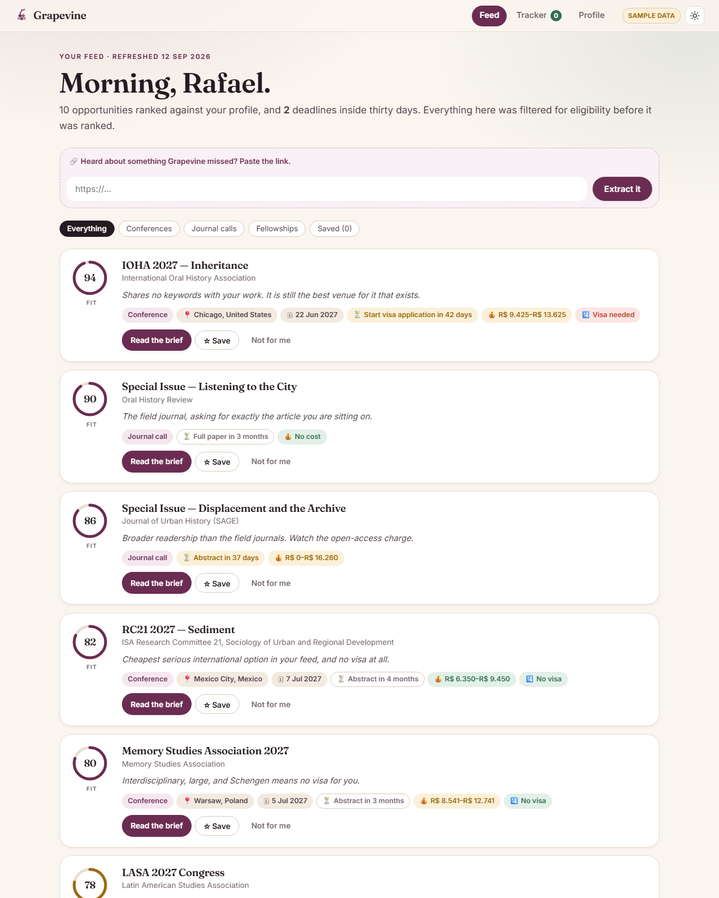
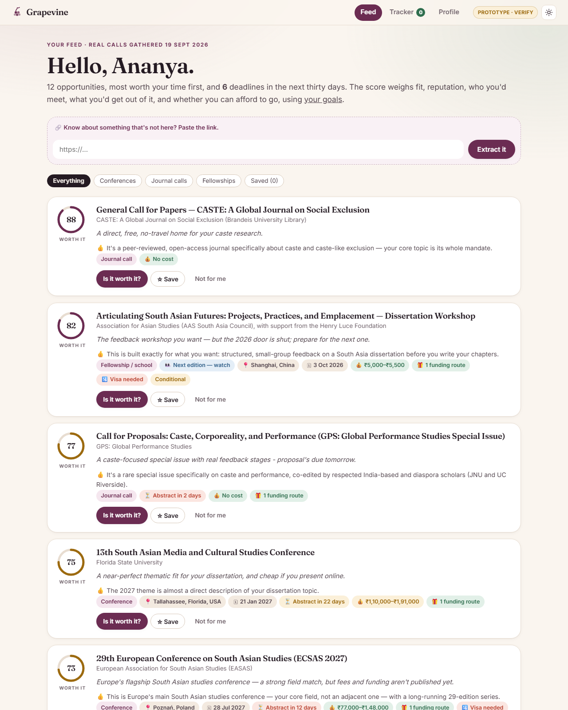

# Module 2: Grapevine skills

**Grapevine** finds conferences, journal calls and fellowships for humanities researchers and tells them whether each one is worth it.
**[Live prototype](https://mavencourse2026.vercel.app)** · **[PRD](PRD.md)**

## The skills

Seven skills in [`.claude/skills/`](.claude/skills/). Each one is a repeated step in the product, written once and reused: I run them in Claude Code to refresh the data, and the live site sends the same files to Claude as its instructions.

| Skill | What it does | Output it produced |
|---|---|---|
| [draft-profile](.claude/skills/draft-profile/SKILL.md) | A few sentences about someone's research → topics, plus the fields next to theirs | [profile](corpus/profiles/ananya.json) |
| [scout-opportunities](.claude/skills/scout-opportunities/SKILL.md) | Finds real calls by reasoning about where the work belongs, not just matching keywords | [16 candidates](corpus/candidates.json) |
| [extract-opportunity](.claude/skills/extract-opportunity/SKILL.md) | Reads a call page. Every date and fee is copied word-for-word as proof | [13 opportunities](corpus/opportunities/) |
| [estimate-cost](.claude/skills/estimate-cost/SKILL.md) | Fees, flights, stay and visa → a cost range in ₹ | in [briefs](corpus/briefs/p_ananya/) |
| [find-funding](.claude/skills/find-funding/SKILL.md) | The organisers' grants plus Indian funders (e.g. ICSSR), in the order to apply | [funder list](corpus/funders/india.json) |
| [compose-brief](.claude/skills/compose-brief/SKILL.md) | "Is it worth it?": 5 scores with reasons, weighted by the person's goals | [13 briefs](corpus/briefs/p_ananya/) |
| [verify-grounding](.claude/skills/verify-grounding/SKILL.md) | Re-opens every page to confirm each date and fee is really there | [report](corpus/grounding-report.md) |

**Flow:** draft-profile → scout → extract → cost + funding → brief → verify → the shortlist in the app.

## Before / after

| | Before (week 1) | After (with skills) |
|---|---|---|
| Data | Made-up sample data | 13 real calls, found and checked by the skills |
| Finding venues | Only what you already search for | Finds venues in neighbouring fields too, e.g. the AoIR internet-research conference. No venue list is hardcoded. (The scout skill's first worked example did describe AoIR's discovery path, which biased results towards it; it's now a neutral example plus a variety rule.) |
| Dates and fees | Invented | Copied from the source page, and re-checked |
| Ranking | Topic match only | "Worth it" score using fit, reputation, network, outcomes and feasibility |
| Funding | Whatever the page mentioned | The organisers' grants plus national funders you qualify for |
| Time per call page | ~25 min by hand | Under a minute |

| Before | After |
|---|---|
|  |  |

## Results

- **94% of quoted facts passed** an independent re-check (44 of 47). The 3 that failed were caught and labelled "check this".
- **6+ of the top 10** don't show up in a plain Google-style search for the same topic.
- **Mistakes caught and fixed in the skills**, e.g. a 2021 journal call shown as open. The skills now check how recent a page is.

## What it made easier

The same seven steps now run the same way every time, for any researcher. That makes refreshing the shortlist, adding a pasted link, or onboarding a new person repeatable instead of a day of manual browsing.
