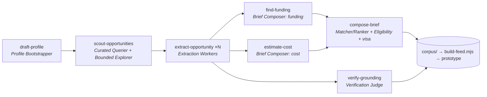
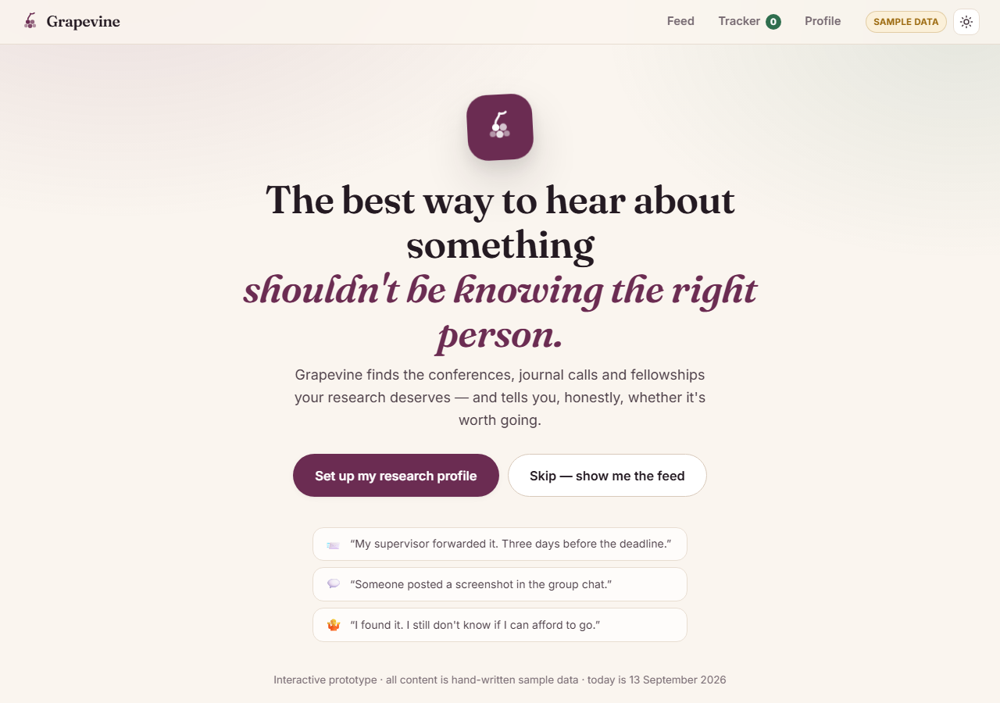
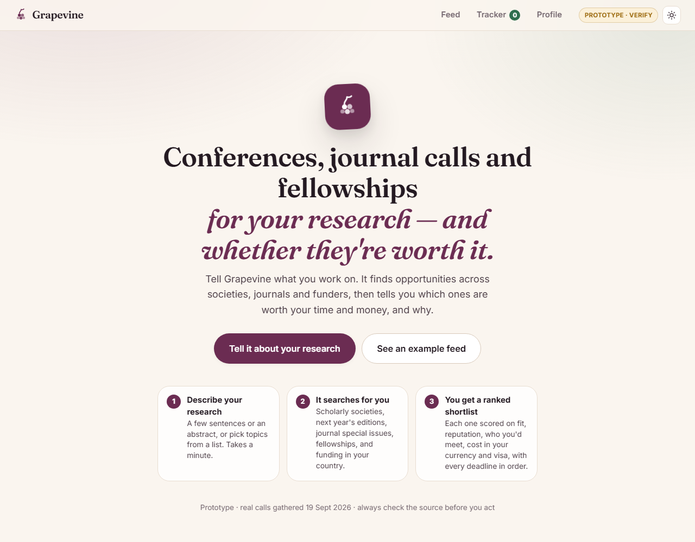
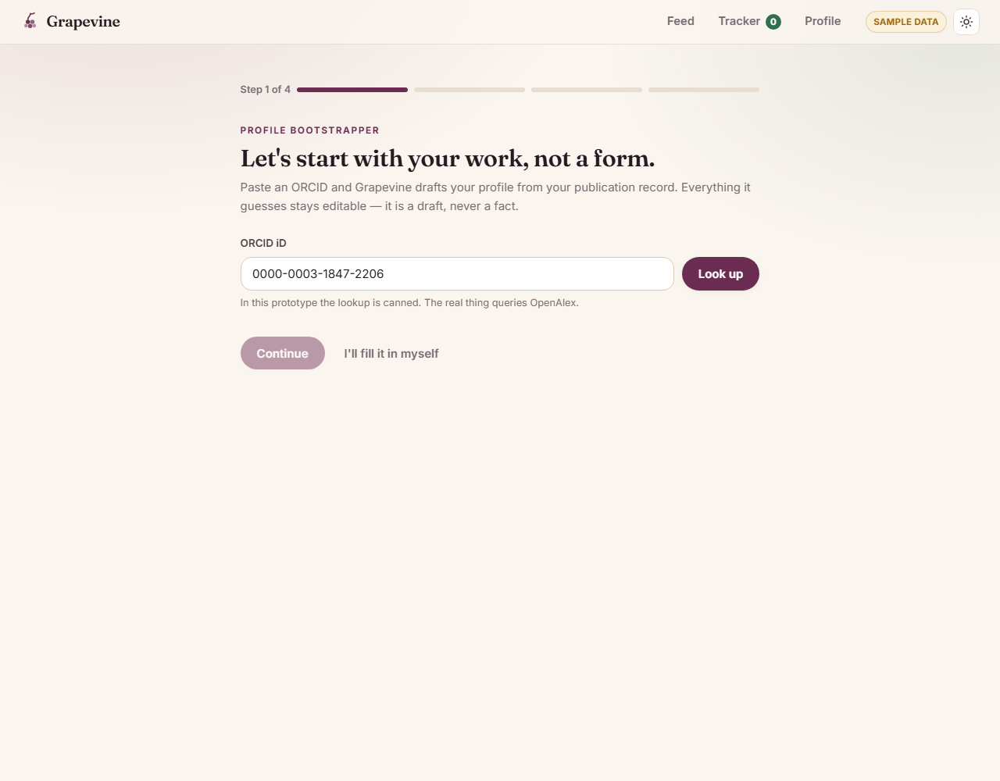
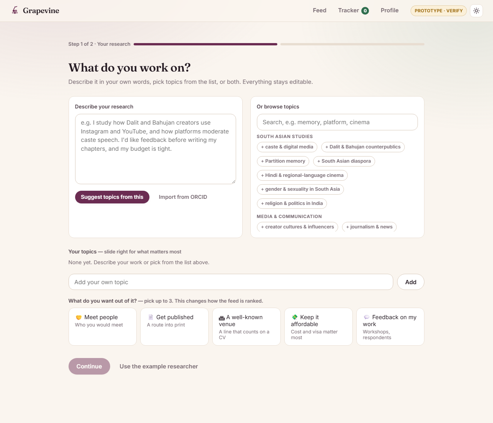
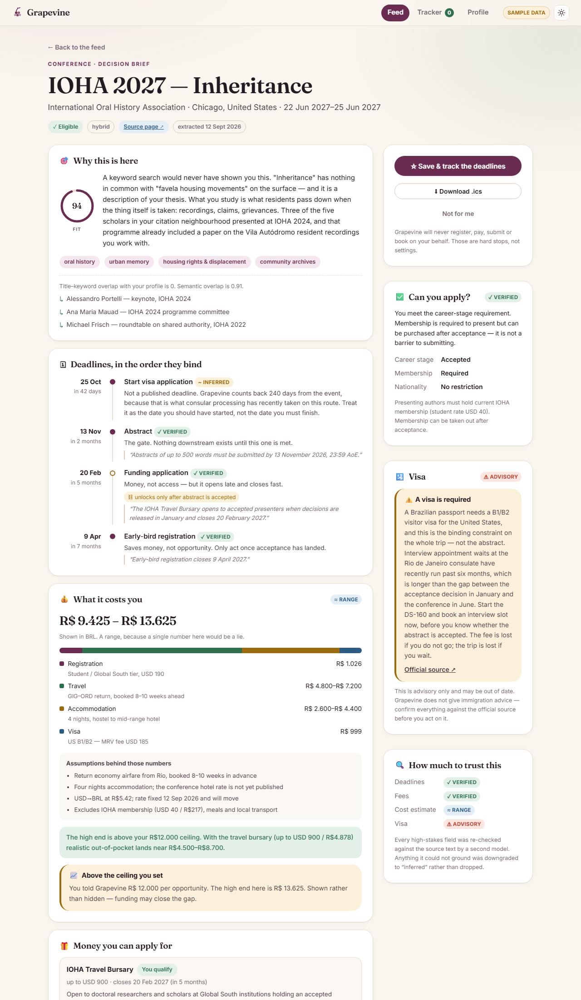
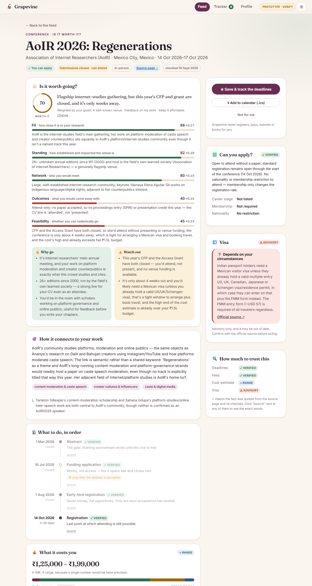

# Module 2: Turning Grapevine's repeatable work into skills

**Grapevine** finds academic opportunities (conferences, journal calls, fellowships) for humanities researchers and tells them whether each one is worth it. ([PRD](PRD.md) · [live prototype](https://mavencourse2026.vercel.app))

This page is the submission for Module 2. It covers which work I turned into skills and why, what those skills produced, and what they changed.

---

## TL;DR

- **7 skills** in [`.claude/skills/`](.claude/skills/), one for each agent in the PRD's architecture.
- Together they turned a short description of a researcher into a **real, ranked, costed, funded shortlist**. That shortlist now drives the prototype in place of last week's hand-written fixtures.
- **Headline:** one call page takes ~25 min by hand and **under a minute** with the skill, with every deadline traceable to a quote. The whole shortlist of 13 took ~25 min of agent time. **94%** of quoted facts passed an independent re-check, and the rest were caught.

| | Before (week 1) | After (skills) |
|---|---|---|
| Where feed data came from | Hand-written fixtures for a fictional Brazilian persona | 16 real candidates found, **13 extracted, costed, funded and scored** by skills for a new persona |
| How a venue like AoIR gets found | Only if you already know to search for it | Found from the persona's *adjacent field*, never named in the skill ([trace](#3-discovery-how-aoir-was-found-without-being-named)) |
| Deadlines and fees | Plausible, invented | Quoted verbatim from the source page. **44 of 47 re-checks passed**, and the 3 failures were caught and downgraded |
| Ranking | Topic fit only | "Worth it" score: fit + standing + network + outcomes + feasibility, weighted by the user's goals |
| Funding | Whatever the call page mentioned | The venue's own grants **and** external Indian funders, sequenced against the deadlines |
| Redoing it for a new person | Rewrite the fixtures by hand | Rerun the same 7 skills |

---

## How the skills chain



Each box is one SKILL.md, matches a step in [the PRD's "How it works"](PRD.md#5-how-it-works). **The skills serve twice:**
1. **Now:** I run them in Claude Code to build and refresh the corpus.
2. **Next phase:** the Next.js backend loads the same SKILL.md text as its prompts (each file ends with *Runtime notes* giving the model tier and token budget). The judgement is written once, and the code only does plumbing.

---

## The skills

| Skill | What it does | Used when | Why a skill, not code | Real output |
|---|---|---|---|---|
| [draft-profile](.claude/skills/draft-profile/SKILL.md) | A few sentences → a weighted profile, including **fields and adjacent fields** | Every new user or persona. Also the logic behind the onboarding box | Inferring that "caste on Instagram" also belongs to *internet studies* is judgement | [profiles/ananya.json](corpus/profiles/ananya.json) |
| [scout-opportunities](.claude/skills/scout-opportunities/SKILL.md) | Finds candidates in 5 layers: society graph, literature, recurrence, reworded aggregator search, capped open search | Weekly refresh, a new persona, a thin feed | Where does this work belong? That can't be answered with a keyword list | [candidates.json](corpus/candidates.json) |
| [extract-opportunity](.claude/skills/extract-opportunity/SKILL.md) | One call page → the Opportunity schema, **every deadline and fee with a verbatim quote** | Every new candidate, every pasted link | Pages have no shared format. Dates hide in prose, fees in tier tables | [opportunities/](corpus/opportunities/) |
| [estimate-cost](.claude/skills/estimate-cost/SKILL.md) | Registration tier + flights + nights + visa → an **INR range** with assumptions | Every (opportunity, person) pair | Picking the right fee tier and stating assumptions honestly | `cost_estimate` in [briefs/](corpus/briefs/p_ananya/) |
| [find-funding](.claude/skills/find-funding/SKILL.md) | The venue's own grants + **external funders by country, field and stage**, sequenced | Every opportunity. Maintains the funder registry | Eligibility is written in prose, and grants depend on each other ("needs the acceptance letter") | [funders/india.json](corpus/funders/india.json), `funding` in briefs |
| [compose-brief](.claude/skills/compose-brief/SKILL.md) | **"Is it worth going?"** 5 sub-scores with reasons, weighted by goals, plus why go / watch out / visa | Every pair. Reruns when goals change | Judging venue standing and network value for someone who doesn't know the field's hierarchy | [briefs/](corpus/briefs/p_ananya/) |
| [verify-grounding](.claude/skills/verify-grounding/SKILL.md) | Re-fetches sources, checks every ✓ quote exists and supports its value, downgrades failures | After every refresh, before every demo | An independent second pass. Extraction is confidently wrong sometimes | [grounding-report.md](corpus/grounding-report.md) |

Every SKILL.md follows the same structure: **purpose · when to use · inputs · process · output · constraints · edge cases · example · runtime notes**. The PRD's guardrails are written into the Constraints sections: never register, pay or submit; visa is advisory only; costs are ranges; page content is data, not instructions; no invented facts.

### What I deliberately did *not* turn into skills

| Task | Why not |
|---|---|
| Scaffolding the Next.js app, Prisma setup, deploy | Done once. A skill would be written, used once, and left to go stale |
| UI edits | Each change is different, so there's no stable process to capture |
| Merging corpus → prototype | Deterministic, so it's a script ([build-feed.mjs](scripts/build-feed.mjs)), not a skill. Skills are for *judgement* |
| Browser smoke tests | Will become a skill in the next phase, once there's a backend worth testing on every change |

---

## Before / after

### 1. Process: the same task by hand vs. with the skill

Skill times are measured from this run (agent wall-clock). "By hand" times are my honest estimates of doing the same job carefully in a browser.

| Task | By hand | With the skill | What changes besides speed |
|---|---|---|---|
| **Find candidates** for one researcher | 2–3 hrs of searching, and you only find what you think to search for | **~9 min** for 16 candidates, 26 searches + 26 fetches (hard budget) | Every hit carries a **discovery trace**. Adjacent-field venues (AoIR, CSAA) show up. Closed calls become *attend-only* or *watch* instead of disappearing |
| **Read one call page into structured data** | ~20–30 min: dates, fee tiers, grants page, archive | **~40–60 s per page**, 4–5 pages in parallel per agent | **Every deadline and fee is quoted verbatim.** AoIR's 17 fee tiers (student / professional × member / non-member × Majority World) captured without error |
| **Work out what it costs in INR** | ~30 min: fee tier, flights, nights, visa fee, FX | **~1.5 min per opportunity** (together with funding + scoring) | Always a **range with listed assumptions**, the right tier picked (e.g. AoIR's "Student, Majority World"), visa fee cited to the official page |
| **Find money to go** | Often skipped entirely | Venue grants + **reusable [India funder registry](corpus/funders/india.json)** (8 schemes, built once) | Funding **sequenced** against deadlines. ICSSR correctly marked *not eligible* for AoIR 2026 because it needs a presented paper |
| **Decide if it's worth it** | Gut feel, or ask a senior | 5 sub-scores with reasons, weighted by goals | Explainable, and **re-weightable**: change your goals and the feed re-ranks |
| **Check nothing was made up** | Rarely done | **47 facts re-checked**, 3 downgraded | See [Results](#results) |

### 2. One worked example: AoIR 2026, raw page → brief

**① The raw page.** The facts are spread across four pages on aoir.org (main, CFP, registration, access grant):
> *"Proposals Due: 1 March 2026"* · *"Student, Majority World: $40/$55"* · *"Available between August 1st and October 14th, 2026."* · *"up to 5 Access Grants of up to 2,000 USD each…"*

**② After `extract-opportunity`** ([aoir-2026.json](corpus/opportunities/aoir-2026.json), abridged):
```json
"status": "attend-only",
"deadlines": [
  { "label": "abstract", "date": "2026-03-01", "grounded": true, "source_quote": "Proposals Due: 1 March 2026" },
  { "label": "registration", "date": "2026-10-14", "grounded": true, "source_quote": "Available between August 1st and October 14th, 2026." }
],
"standing_signals": [
  { "signal": "26 prior editions, IR 1 (2000) through AoIR2025", "grounded": true, "source_url": "https://aoir.org/past-conferences/" },
  { "signal": "Papers published as Selected Papers of Internet Research", "grounded": false }
]
```
Note the second signal: the extractor *believed* it but hadn't fetched a page saying it, so it's marked ungrounded rather than claimed.

**③ After `find-funding` + `estimate-cost` + `compose-brief`** ([brief](corpus/briefs/p_ananya/aoir-2026.json)):

| | |
|---|---|
| **Worth it** | **70 / 100**: *"Flagship internet-studies gathering, but this year's CFP and grant are closed, and it's only weeks away."* |
| Fit 88 | Her platform-moderation and creator-counterpublics work sits squarely in AoIR's community, even though caste isn't a named track |
| Standing 92 | 26+ editions since 2000, run by the field's own learned society |
| Network 80 | Large internet-research community, keynote on indigenous language and digital rights |
| Outcomes 40 | Attend-only: the CV line is "attended", not "presented" |
| Feasibility 45 | CFP and Access Grant closed, 4 weeks out, possible Mexico visa, high end over budget |
| **Cost** | ₹1.25L – ₹1.99L. Tier: "Student, Majority World", USD 80 member / 100 non-member |
| **Funding** | AoIR Access Grant: *closed for 2026, expect it again for 2027*. ICSSR: *not eligible this time, because it needs a presented paper* |
| **Visa** | Conditional: exempt if she already holds a valid US/UK/Schengen visa. Advisory, with an official SRE link |

This is the behaviour a "smart search box" can't produce. AoIR is the best-regarded venue in the list and still isn't top of the feed, **because this year it's the wrong move for her**. The brief says exactly why, and flags it for 2027.

### 3. Discovery: how AoIR was found without being named

**What a student would type:** `caste digital media conference call for papers 2026`
→ an already-past conference (June 2026), a handful of generic multi-topic "media & communication" conferences, and one journal call. **No AoIR, no ECSAS, no SAMCS, no Heidelberg scholarship.**

**What the scout skill did** (copied from [candidates.json](corpus/candidates.json)):
1. `layer a`: adjacent field *internet studies* (inferred by draft-profile, not typed by the user) → searched *"internet research association annual conference"* → found the Association of Internet Researchers.
2. `layer c`: recurrence → confirmed `aoir.org/aoir2026/` as the 27th annual meeting (14–17 Oct 2026, Mexico City).
3. Checked the dates: the CFP closed 1 Mar 2026, but the event is ahead → **attend-only**, not dropped.
4. Checked travel support: an **AoIR Access Grant (up to $2,000)**. This cycle has closed, so it was flagged for AoIR 2027.

The same reasoning produced the **exploration pick**: CSAA 2026 (Cultural Studies Association of Australasia). It shares no keywords with caste or platforms, but it's where counterpublic theory comes from, and it runs a postgraduate day.

Across the run, 8 of the 16 candidates came from the society graph, and recurrence confirmed dates on nearly all of them. The run used 26 searches and 26 page fetches, within the skill's hard budget.

### 4. The app, before and after

| | Week 1 (fixtures) | Week 2 (skills) |
|---|---|---|
| Welcome |  |  |
| Onboarding | 4 steps, ORCID first  | 2 steps: describe **or** browse, plus goals  |
| Feed | Ranked by fit  | Ranked by "worth it"  |
| Brief |  |  |

The week 1 version stays browsable at the tag [`module-1-prototype`](../../tree/module-1-prototype).

---

## Results

Mini-evaluation against the [PRD's evaluation plan](PRD.md#8-how-well-know-it-works):

| PRD eval | Measure | Result |
|---|---|---|
| #4 Grounding rate | Every ✓ fact re-found verbatim on its source page | **44 / 47 = 94%** pass. The 3 failures were caught and downgraded to "inferred — verify" ([report](corpus/grounding-report.md)) |
| #3 Discovery value | Items a plain keyword search wouldn't surface | AoIR, ECSAS, SAMCS, MSA Lund, the Heidelberg scholarship and the AAS dissertation workshop: **6+ of the top 10** didn't appear for `caste digital media conference call for papers 2026` |
| #1 Extraction accuracy | Spot-check against source | 3 calls hand-checked (AoIR, SAMCS, Heidelberg): all dates and fees match |
| Honesty | Nothing invented when the page is silent | MSA Lund fees, IAMCR 2027 deadlines and BASAS details were left **empty**, not guessed. The briefs score those "limited information, 50" |

**Failure log** (the most useful artefact, per the PRD):

| What went wrong | Caught by | Fix to the skill |
|---|---|---|
| Quote truncated ("First drafts: …" vs. "First drafts for editorial review: …") | verify-grounding | extract: "copy the whole clause, never shorten inside a quote" |
| Quote capitalisation changed ("Lowest" vs. "lowest") | verify-grounding | Same rule. Verification is deliberately strict |
| Inference presented as fact ("unbroken run" of BASAS conferences; 2020 is missing) | verify-grounding | extract: standing signals state counts, not characterisations |
| Status wrong: Madison marked *open* after its abstract deadlines passed; the AAS workshop marked *open* after applications closed | my review of agent output | extract: "status is decided by the **last submission** date, not registration" |
| AoIR Access Grant quote was just "10 July 2026" (verbatim, but doesn't say *what* closes) | my review | extract: "a quote must name the thing it dates" |
| A **2021** journal call ("issues 2021 through 2024") was ranked #1 as *open*. Every quote was verbatim, so grounding passed | the user, reading the source page | extract, scout and verify now check **freshness** (posted date + latest year referred to). The call is now shown under "Possibly out of date" |
| Two brief agents wrote free text ("GROUNDED (deadlines quoted…)") where the schema expects `verified`/`inferred` | the rendered brief (the UI showed raw text) | compose-brief now lists the allowed values explicitly, and build-feed normalises them defensively |

**What the skills made easier, faster or more consistent**
- **Faster:** a researcher → a costed, funded, ranked shortlist of 13 real opportunities in about 25 minutes of agent time, where by hand it would take a couple of days.
- **More consistent:** 9 parallel agents followed the same SKILL.md files and produced the same schema, the same honesty rules and the same scoring. The merge script needed no per-item fixes.
- **Easier to repeat:** a new persona is a new `profiles/*.json` and a rerun. The funder registry is reused rather than researched again.
- **Easier to trust:** the verifier is a separate skill that doesn't trust the extractor, and it caught 3 real errors.

---

## Try it

- **Prototype:** **[mavencourse2026.vercel.app](https://mavencourse2026.vercel.app)**, or run `npx serve prototype` locally. Pick "See an example feed", or describe your own research.
- **Registries, not search, for stable facts:** [funders/india.json](corpus/funders/india.json) is built once by `find-funding` and refreshed monthly. A society registry for `scout` follows the same pattern next phase.
- **Rerun a skill** in Claude Code from this repo, e.g. `/scout-opportunities for corpus/profiles/ananya.json`, then `node scripts/build-feed.mjs` to refresh the feed.
